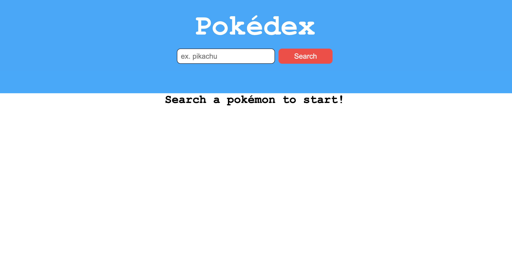
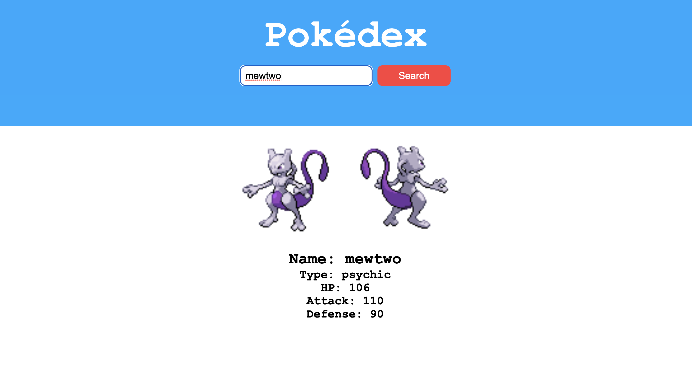

# Pokedex-PokeApi

 

## Background:
Just practicing using and building a simple app using an API.

1.  As you arrive on the home page it'll prompt you search for a Pokémon. Once you make your search it'll render up the image, name and stats of that particular Pokémon.
    &nbsp; &nbsp; 

## What I Used:
- React
- CSS
- [PokéAPI](https://pokeapi.co/)
- JavaScript
